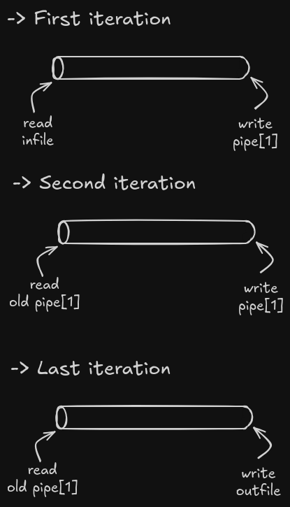

# Project Report: `pipex`

## 1. Objective

The goal of this project was to replicate Bash pipes.

- Read from an input file, run commands, pipe them to another command, and write to an output file.
- Clean error handling: no leaks and no open file descriptors.
- Support multiple pipelines.

## 2. Implementation Summary

- **Language:** C
- **Key features:**
  - Recreates shell piping (`|`) in Bash: runs commands with stdin/stdout chained via pipes.
  - Usage: `./pipex infile "c1" "c2" ... "cN" outfile`

- **Interesting design decisions:**
  - For each command, a `fork()` creates a child process responsible for running the command.
  - A `pipe` is also created. The read and write ends are configured to the correct input/output files.
  
  - Parsing is solid—more than required—but it should help in minishell.

## 3. Challenges Faced

- **How to handle file descriptor closing**  
  I struggled A LOT with closing file descriptors and honestly only got it right through trial and error, which means I’m still iffy about when I should or shouldn’t close them.

- **Bash results**  
  I wanted my *pipex* to behave as closely as possible to Bash, but sometimes I got confused—at one time I was certain that Bash tries to run a command in the current directory first, which isn’t true.

- **New concepts all around**  
  I needed to learn about processes and change my mindset to see my program as a process. It’s a learning curve that looks almost impossible at the beginning.

## 4. What I Learned

- `execve` and its intricacies — like how it replaces the process that calls it if there is no error executing the command.  
- Environment variables — it’s exciting to know that `argc`, `argv`, and variadic arguments aren’t the only inputs for `main`. I can’t wait to learn what’s next; maybe I’ll be able to receive patience as an input.  
- Signals — it’s the first time I’ve ever used `exit(EXIT_FAILURE)` or `exit(EXIT_SUCCESS)`. How exciting!

## 5. What I’d Do Differently

- Before starting a project that involves new stuff, I should study the underlying concepts thoroughly before working on the project itself.

## 6. Future Improvements

- Go for the second bonus with `here_doc`.
- Take care of status codes and replicate Bash’s behaviour exactly.

## 7. Resources & References

- [Unix Processes in C — CodeVault](https://www.youtube.com/watch?v=cex9XrZCU14&list=PLfqABt5AS4FkW5mOn2Tn9ZZLLDwA3kZUY)  
- [Os Lusíadas](https://oslusiadas.org/)  
- My own tears and `gdb`  
- My friends and colleagues at 42 Lisboa

---

**Overall, `pipex` challenged me to understand Unix processes like pipes, forks, and `execve`. I had a blast working on this project!**

